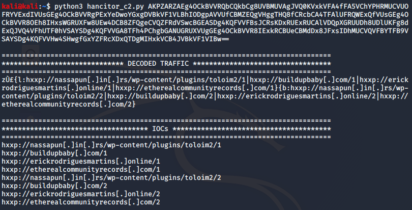

# Decode Hancitor Post-Infection Traffic
Decode Hancitor C2 traffic streams and extract C2 URL IOCs. This script base64 decodes the C2 response and XORs the result with hex key 7a. 

### Usage
```python3 hancitor_c2.py <encoded_traffic>``` <br/>

`<encoded_traffic>` = the base64 blob in the C2 response

### Demo
The tcp stream below shows a Hancitor post-infection request and response. 


The "1a4" at the beginning of the response packet is simply the hex value of the length of the base64 string, so we will discard it. We will also discard the "0" at the end. 


