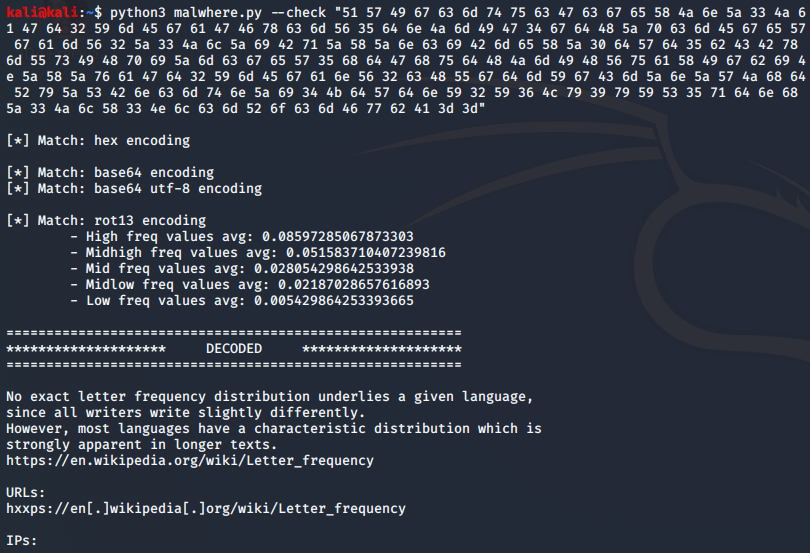
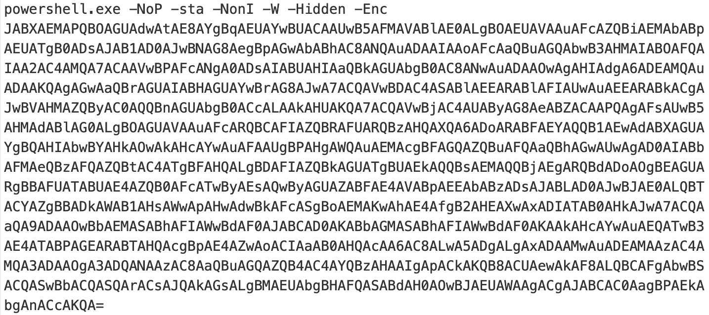
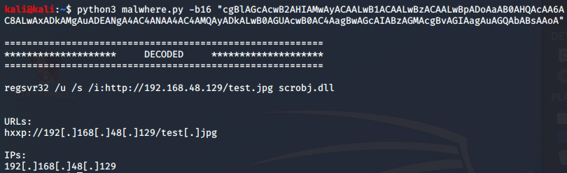
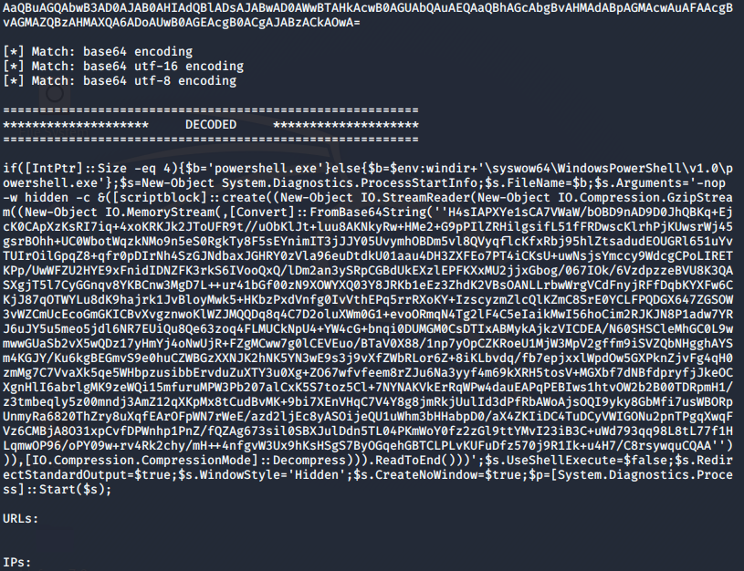
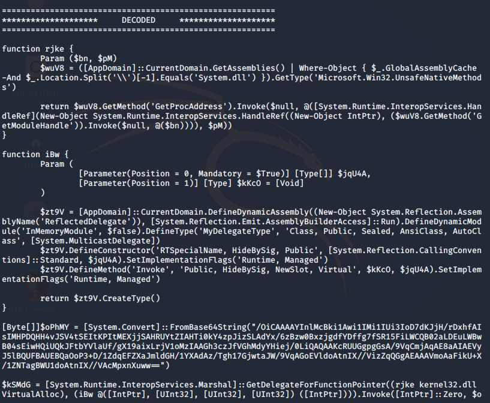
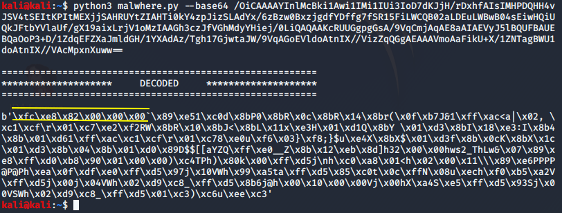
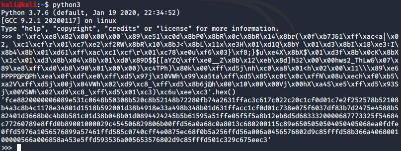
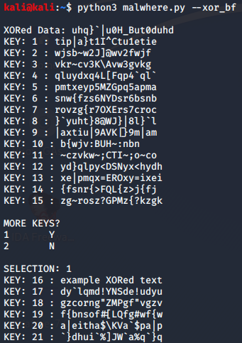
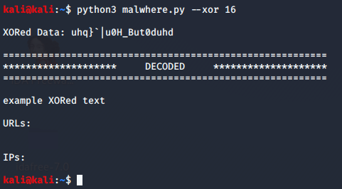

# Analyze Encoded, Compressed, or Obfuscated Data
Decode, decompress, and deobfuscate malicious payloads and indicators. Analyze multi-layer gibberish to find concealed malicious content and IOCs. Obtain sanitized or unsanitized IOCs from the results. 

### Usage
To see the program help message: </br>
```python3 malwhere.py -h``` </br>
or </br>
```python3 malwhere.py --help``` </br>

Output of the help message explains each option's usage: </br>
```
usage: malwhere.py [-h] [--check CHECK_ENC] [--base64 B64_STR]
                   [--base64_utf8 B64_UTF8_STR] [--base64_utf16 B64_UTF16_STR]
                   [--base64_gunzip B64_GZIP_STR] [--hex HEX_STR]
                   [--hex_gunzip HEX_GZIP_STR] [--url URL_STR] [--bin BIN_STR]
                   [--rot13 ROT13_STR] [--xor XORKEY] [--xor_bf]
                   [--header EMAIL_HEADER] [--gunzip GZIPPED_FILE] [--desan]
                   [--ioc IOCS]

Decode, decompress, and deobfuscate malicious payloads and indicators.

optional arguments:
  -h, --help            show this help message and exit
  --check CHECK_ENC, -c CHECK_ENC
                        detect encoding/compression/obfuscation methods
  --base64 B64_STR, -b64 B64_STR
                        decode base64 (non-Unicode)
  --base64_utf8 B64_UTF8_STR, -b8 B64_UTF8_STR
                        decode base64 (UTF-8)
  --base64_utf16 B64_UTF16_STR, -b16 B64_UTF16_STR
                        decode base64 (UTF-16)
  --base64_gunzip B64_GZIP_STR, -bg B64_GZIP_STR
                        decode base64-encoded gzip compression
  --hex HEX_STR, -hx HEX_STR
                        decode hex to ascii
  --hex_gunzip HEX_GZIP_STR, -hg HEX_GZIP_STR
                        decode hex-encoded gzip compression
  --url URL_STR, -u URL_STR
                        decode URL(percent) encoding
  --bin BIN_STR, -b BIN_STR
                        decode binary to ascii
  --rot13 ROT13_STR, -r ROT13_STR
                        decode rot13
  --xor XORKEY, -x XORKEY
                        decode XOR with a given key
  --xor_bf, -xbf        decode XOR by brute force
  --header EMAIL_HEADER, -hdr EMAIL_HEADER
                        decode MIME encoded-word headers
  --gunzip GZIPPED_FILE, -gz GZIPPED_FILE
                        decompress gzipped file
  --desan, -d           show desanitized results
  --ioc IOCS, -i IOCS   extract URLs and IPs
  ```
  
**NOTES:** The `--ioc` option can take either a string or a file (.csv or .txt) as input. </br>
The `--gunzip` option takes a gzipped file as input. </br>
The `--base64` option does not extract URLs/IPs since its primary objective is to return a bytes object. If the decoded base64 is in fact a string and not a bytes object, use the `-b8`, `-b16` or `--check` options.


### Demos
Below is an example that uses the `--check` option to detect and decode multiple layers of encoding.



Consider the following malicious PowerShell example presented [here](https://redcanary.com/blog/investigating-powershell-attacks/). 



The payload is UTF-16 and base64 encoded, so the `-b16` option successfully decodes the encoded PowerShell command.



Another common way to obfuscate malicious PowerShell commands is to gzip and then base64 encode them. For such scenarios, use the `-bg` option. Consider the following encoded PowerShell payload found [here](https://pastebin.com/u6xKPNTh). 


The following output was produced using the `--check` option. The `-b8` option also would have worked. 



The output contains a gzipped-compressed base64-encoded string. Using the `-bg` option against this string produces the following output. The `--check` option would have worked as well.



The final base64 string contains a bytes object, which represents the final shellcode. The "FC E8 82 00 00 00" bytes in the beginning indicate a likely Metasploit payload. 



You could then convert the bytes to hex using a simple line of code in the normal Python interpreter to obtain the final shellcode for post-triage investigation. 



The `--xor` and `--xor_bf` options prompt for input rather than taking the encoded data as a command line argument. See the examples below.

XOR brute force example: </br>


XOR with known key: </br>

